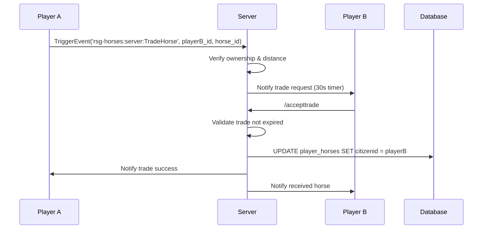

# RSG-Horses Documentation 
**Framework:** RSG Core (RedM)  
**License:** GPL-3.0

---

## Table of Contents
1. [Overview](#overview)
2. [Features](#features)
3. [Dependencies](#dependencies)
4. [Installation](#installation)
5. [Configuration](#configuration)
6. [Database Schema](#database-schema)
7. [Client-Side Architecture](#client-side-architecture)
8. [Server-Side Architecture](#server-side-architecture)
9. [Commands & Keybinds](#commands--keybinds)
10. [Item System](#item-system)
11. [Horse XP & Leveling](#horse-xp--leveling)
12. [Bonding System](#bonding-system)
13. [Customization System](#customization-system)
14. [Horse Trading](#horse-trading)
15. [Horse Death & Aging](#horse-death--aging)
16. [API & Exports](#api--exports)
17. [Localization](#localization)
18. [Troubleshooting](#troubleshooting)

---

## Overview

**rsg-horses** is a comprehensive horse management system for RedM servers using the RSG Framework. It provides full ownership, persistent data, customization, XP progression, bonding mechanics, and interactive horse behaviors.

### Key Capabilities
- **Persistent Horse Ownership** - horses are saved per player with unique IDs
- **Dynamic Spawning** - horses spawn at stables with proper distance-based culling
- **XP & Leveling** - 10 levels affecting health, stamina, speed, acceleration, and inventory
- **Bonding System** - 4 bonding levels that unlock abilities
- **Component System** - saddles, blankets, stirrups, horns, saddlebags, manes, tails, masks, bedrolls, mustaches
- **Interactive Actions** - horses can drink from troughs/water, graze on hay, play, and lay down
- **Horse Aging** - horses die after a configurable number of days
- **Trading** - players can trade horses with each other
- **Death & Revival** - horses can die and be revived with horse reviver items

---

## Features

### Core Features
- ✅ **Multiple Stables** - 9 pre-configured stable locations (Valentine, Blackwater, Saint Denis, Rhodes, Strawberry, Tumbleweed, Van Horn, Emerald Ranch, Colter)
- ✅ **Horse Customization** - 10 customizable component categories
- ✅ **Horse Inventory** - saddlebags with level-based weight/slots
- ✅ **Usable Items** - brush, lantern, feed items, stimulant, reviver
- ✅ **Dynamic Stats** - health/stamina/speed scale with XP
- ✅ **Horse Actions** - lay down, play tricks, drink, graze (XP-gated)
- ✅ **Horse Gender** - male (gelding) or female (mare)
- ✅ **Fleeing** - horses can flee and optionally auto-store
- ✅ **Blips** - horses show on map with their name
- ✅ **Target Support** - ox_target integration for NPC horses
- ✅ **Prompt System** - native RedM prompts for actions

### Advanced Features
- ✅ **Server-Side Validation** - ownership, component, and trade security
- ✅ **Routing Buckets** - customization happens in isolated instances
- ✅ **Upkeep System** - automatic age checking and death handling
- ✅ **Telegram Integration** - death notifications via in-game telegrams
- ✅ **Grace Period** - 60-second window to revive dead horses
- ✅ **Road Spawning** - optional spawn-on-road-only mode
- ✅ **Auto-Mount** - optional auto-mount on spawn
- ✅ **Persistent Stock** - shop stock can persist across restarts

---

## Dependencies

### Required
| Resource | Purpose | Link |
|----------|---------|------|
| **rsg-core** | Core framework | [GitHub](https://github.com/Rexshack-RedM/rsg-core) |
| **rsg-inventory** | Inventory system & horse saddlebags | [GitHub](https://github.com/Rexshack-RedM/rsg-inventory) |
| **ox_lib** | Menus, prompts, callbacks, locales | [GitHub](https://github.com/overextended/ox_lib) |
| **oxmysql** | MySQL wrapper | [GitHub](https://github.com/overextended/oxmysql) |

### Optional
| Resource | Purpose |
|----------|---------|
| **ox_target** | Targeting for stable NPCs and horses |
| **rsg-menubase** | Legacy menu system (used for customization UI) |

---

## Installation

### Step 1: Download & Extract
1. Place `rsg-horses` into `resources/[rsg]/`
2. Ensure folder name is exactly `rsg-horses`

### Step 2: Database Setup
```bash
# Import SQL file
mysql -u username -p database_name < installation/rsg-horses.sql
```

Or manually execute:
```sql
CREATE TABLE IF NOT EXISTS `player_horses` (
  `id` int(11) NOT NULL AUTO_INCREMENT,
  `stable` varchar(50) NOT NULL,
  `citizenid` varchar(50) NOT NULL,
  `horseid` varchar(11) NOT NULL,
  `name` varchar(255) NOT NULL,
  `horse` varchar(50) DEFAULT NULL,
  `dirt` int(11) DEFAULT 0,
  `horsexp` int(11) DEFAULT 0,
  `components` LONGTEXT NOT NULL DEFAULT '{}',
  `gender` varchar(11) NOT NULL,
  `wild` varchar(11) DEFAULT NULL,
  `active` tinyint(4) DEFAULT 0,
  `born` int(11) NOT NULL DEFAULT 0,
  PRIMARY KEY (`id`)
) ENGINE=InnoDB DEFAULT CHARSET=utf8mb4;
```

### Step 3: Add Items to Inventory
Add these to your `rsg-inventory/shared/items.lua`:
```lua
['horse_brush']       = { name = 'horse_brush',       label = 'Horse Brush',      weight = 200,  type = 'item', image = 'horse_brush.png',      unique = false, useable = true, shouldClose = true, description = 'Brush your horse' },
['horse_lantern']     = { name = 'horse_lantern',     label = 'Horse Lantern',    weight = 500,  type = 'item', image = 'horse_lantern.png',    unique = false, useable = true, shouldClose = true, description = 'Light for your horse' },
['sugarcube']         = { name = 'sugarcube',         label = 'Sugar Cube',       weight = 50,   type = 'item', image = 'sugarcube.png',        unique = false, useable = true, shouldClose = true, description = 'Sweet treat' },
['horse_carrot']      = { name = 'horse_carrot',      label = 'Horse Carrot',     weight = 100,  type = 'item', image = 'horse_carrot.png',     unique = false, useable = true, shouldClose = true, description = 'Feed your horse' },
['horse_apple']       = { name = 'horse_apple',       label = 'Horse Apple',      weight = 100,  type = 'item', image = 'horse_apple.png',      unique = false, useable = true, shouldClose = true, description = 'Feed your horse' },
['haysnack']          = { name = 'haysnack',          label = 'Hay Snack',        weight = 200,  type = 'item', image = 'haysnack.png',         unique = false, useable = true, shouldClose = true, description = 'Hay for your horse' },
['horsemeal']         = { name = 'horsemeal',         label = 'Horse Meal',       weight = 300,  type = 'item', image = 'horsemeal.png',        unique = false, useable = true, shouldClose = true, description = 'Full meal for horse' },
['horse_stimulant']   = { name = 'horse_stimulant',   label = 'Horse Stimulant',  weight = 100,  type = 'item', image = 'horse_stimulant.png',  unique = false, useable = true, shouldClose = true, description = 'Boosts horse stamina' },
['horse_reviver']     = { name = 'horse_reviver',     label = 'Horse Reviver',    weight = 200,  type = 'item', image = 'horse_reviver.png',    unique = false, useable = true, shouldClose = true, description = 'Revive a dead horse' },
```

### Step 4: Configure server.cfg
```cfg
ensure ox_lib
ensure oxmysql
ensure rsg-core
ensure rsg-inventory
ensure rsg-horses
```

### Step 5: Restart Server
```bash
restart rsg-horses
# or full restart
restart
```

---

## Configuration

Configuration is split across multiple files in `shared/`:

### `shared/config.lua`

#### Shop Items
```lua
Config.horsesShopItems = {
    { name = 'horse_brush',     amount = 10, price = 5 },
    { name = 'horse_lantern',   amount = 10, price = 10 },
    { name = 'sugarcube',       amount = 50, price = 0.05 },
    -- ... more items
}
Config.PersistStock = false -- Persist shop stock in database
```

#### General Settings
```lua
Config.EnableTarget        = true   -- Use ox_target instead of prompts
Config.TargetHelp          = false  -- Show target help (L-ALT)
Config.Automount           = false  -- Auto-mount horse on spawn
Config.SpawnOnRoadOnly     = false  -- Force horse spawn near roads
Config.HorseInvWeight      = 16000  -- Max inventory weight (level 10)
Config.HorseInvSlots       = 25     -- Max inventory slots (level 10)
Config.CheckCycle          = 30     -- Upkeep check interval (minutes)
Config.StarterHorseDieAge  = 7      -- Starter horse lifespan (days)
Config.HorseDieAge         = 365    -- Normal horse lifespan (days)
Config.StoreFleedHorse     = false  -- Auto-store when fleeing
Config.EnableServerNotify  = false  -- Console notifications
Config.KeyBind             = 'J'    -- Horse call keybind
Config.AllowTwoPlayersRide = true   -- Allow multiple riders
Config.DeathGracePeriod    = 60000  -- Death grace period (ms)
```

#### Inventory by Level
```lua
Config.Level1InvWeight = 4000   -- Level 1
Config.Level1InvSlots = 4

Config.Level10InvWeight = 16000 -- Level 10
Config.Level10InvSlots = 25
```

#### Horse Stats by Level
```lua
Config.Level1 = 100    -- Health/Stamina/Speed for level 1
Config.Level10 = 2000  -- Health/Stamina/Speed for level 10
```

#### Horse Feed Items
```lua
Config.HorseFeed = {
    ['horse_carrot']    = { health = 10,  stamina = 10,  ismedicine = false },
    ['horse_apple']     = { health = 15,  stamina = 15,  ismedicine = false },
    ['sugarcube']       = { health = 25,  stamina = 25,  ismedicine = false },
    ['horsemeal']       = { health = 75,  stamina = 75,  ismedicine = false },
    ['horse_stimulant'] = { health = 100, stamina = 100, ismedicine = true, medicineHash = 'consumable_horse_stimulant' },
}
```

#### Bonding Settings
```lua
Config.MaxBondingLevel = 5000 -- Max bonding XP
```

#### Stable Locations
```lua
Config.StableSettings = {
    {
        stableid = 'valentine',
        coords = vector3(-365.2, 791.94, 116.18),
        npcmodel = `u_m_m_bwmstablehand_01`,
        npccoords = vector4(-365.2, 791.94, 116.18, 180.9),
        horsecustom = vec4(-388.5212, 784.0562, 115.8154, 150.4135),
        showblip = true
    },
    -- ... 8 more stables
}
```

#### Trick XP Requirements
```lua
Config.TrickXp = {
    Lay = 1000,  -- XP needed to lay down
    Play = 2000  -- XP needed to play tricks
}
```

#### Component Pricing
```lua
Config.PriceComponent = {
    Blankets = 5,
    Saddles = 2,
    Horns = 10,
    Saddlebags = 3,
    Stirrups = 4,
    Bedrolls = 5,
    Tails = 4,
    Manes = 3,
    Masks = 3,
    Mustaches = 2,
}
```

### `shared/horse_settings.lua`

Defines which horses appear at which stables:

```lua
return {
    {
        horsecoords = vector4(-371.9695, 787.4564, 116.1761, 96.6926),
        horsemodel = `a_c_horse_americanpaint_greyovero`,
        horseprice = 50,
        horsename = "American Paint Grey Overo",
        stableid = "valentine"
    },
    -- ... hundreds more horses
}
```

### `shared/horse_comp.lua`

Defines all customization components (saddles, blankets, etc.). Each entry has:
- `hashid` - Unique ID
- `category` - Component type
- `category_hash` - Game hash for category
- `hash` - Game hash for specific variant

**Example:**
```lua
{
    hashid = 1,
    category = "saddles",
    category_hash = 0xBAA7E618,
    hash = 0xC5913F48,
}
```

---

## Database Schema

### `player_horses` Table

| Column | Type | Description |
|--------|------|-------------|
| `id` | INT(11) AUTO_INCREMENT | Primary key |
| `stable` | VARCHAR(50) | Stable ID where horse is stored |
| `citizenid` | VARCHAR(50) | Player citizen ID (foreign key) |
| `horseid` | VARCHAR(11) | Unique horse identifier (e.g. "ABC123") |
| `name` | VARCHAR(255) | Custom horse name |
| `horse` | VARCHAR(50) | Horse model hash/name |
| `dirt` | INT(11) DEFAULT 0 | Dirtiness level (0-100) |
| `horsexp` | INT(11) DEFAULT 0 | Horse experience points |
| `components` | LONGTEXT DEFAULT '{}' | JSON of applied components |
| `gender` | VARCHAR(11) | 'male' or 'female' |
| `wild` | VARCHAR(11) | Reserved for future use |
| `active` | TINYINT(4) DEFAULT 0 | 1 if currently active |
| `born` | INT(11) DEFAULT 0 | Unix timestamp of creation |

**Indexes:**
- Primary key on `id`
- Suggested indexes: `citizenid`, `horseid`, `active`

---

## Client-Side Architecture

### File Structure

```
client/
├── client.lua      # Main client logic (spawn, menu, prompts)
├── horses.lua      # Stable horse spawning & purchase
├── action.lua      # Interactive actions (drink, graze)
├── horseinfo.lua   # Horse info display
├── npcs.lua        # Stable NPC spawning
└── dataview.lua    # Native data handling
```

### Key Functions

#### `SpawnHorse()`
Spawns the player's active horse with all stats, components, and XP applied.

**Process:**
1. Fetch active horse data from server
2. Validate spawn location (road check if enabled)
3. Create horse ped with model
4. Apply flags (behavior, personality, ownership)
5. Load and apply components from database
6. Set XP-based attributes (health, stamina, speed, etc.)
7. Calculate bonding level
8. Apply gender appearance
9. Create blip
10. Setup prompts
11. Move horse to player

#### `SetupHorsePrompts()`
Creates native prompts for horse interaction:
- **Lay** - Requires XP >= 1000
- **Play** - Requires XP >= 2000
- **Saddlebag** - Always available

#### `MainMenu(horses, horsedata)`
Opens customization menu using `rsg-menubase`:
- Component selection
- Real-time preview
- Price calculation
- Purchase confirmation

#### `CustomHorse(horses, data)`
Component selection submenu with sliders for each category.

#### `moveHorseToPlayer()`
Pathfinds horse to player and stops when within 7 meters.

---

## Server-Side Architecture

### File Structure

```
server/
├── server.lua          # Main server logic
└── versionchecker.lua  # Version checking
```

### Security Features

#### `VerifyHorseOwnership(citizenid, horseid)`
Ensures player owns the horse before any operation.

#### `ValidateComponents(components)`
Validates component data against `horse_comp.lua` to prevent exploits.

#### Trade System
- Distance checks (max 5.0 units)
- Expiration timers (30 seconds)
- Ownership verification
- Atomic transfers

### Key Events

#### `rsg-horses:server:BuyHorse`
**Security:**
- Name validation (alphanumeric, 1-50 chars)
- Atomic money removal (remove first, then create)
- Generates unique `horseid`

**Process:**
1. Validate horse model exists
2. Remove money
3. Generate unique horse ID
4. Insert into database
5. Notify player

#### `rsg-horses:server:SaveComponents`
**Security:**
- Component validation
- Ownership verification
- Price calculation

**Process:**
1. Fetch current components
2. Calculate price difference
3. Remove money
4. Update database

#### `rsg-horses:server:TradeHorse`
**Flow:**
1. Sender triggers trade with player ID and horse ID
2. Server validates ownership & distance
3. Trade request stored with 30s expiration
4. Target receives notification
5. Target runs `/accepttrade`
6. Server validates trade still valid
7. Ownership transferred atomically
8. Both players notified

#### `rsg-horses:server:HorseDied`
**Flow:**
1. Client detects death (after grace period)
2. Server verifies active horse
3. Delete horse inventory
4. Delete horse from database
5. Send telegram notification
6. Log to rsg-log

### Upkeep System (`UpkeepInterval()`)

Runs every `Config.CheckCycle` minutes:

1. Fetch all horses from database
2. Calculate age in days
3. Check if:
   - Starter horse (`a_c_horse_mp_mangy_backup`) >= `Config.StarterHorseDieAge` days
   - Normal horse >= `Config.HorseDieAge` days
4. Delete horse & inventory
5. Send telegram to owner
6. Log death

---

## Commands & Keybinds

### Commands

| Command | Description | Permission |
|---------|-------------|------------|
| `/sethorsename` | Rename your active horse | Player |
| `/findhorse` | Show locations of all your horses | Player |
| `/accepttrade` | Accept a pending horse trade | Player |

### Keybinds

| Key | Action | Notes |
|-----|--------|-------|
| **H** | Call/Whistle Horse | Default RSGCore keybind |
| **G** | Open Horse Inventory | `Config.HorseInvKey` |
| **J** | Alternative Call | `Config.KeyBind` (configurable) |
| **Left/Right Arrow** | Rotate Horse | During customization |

### Prompts (Near Horse)

| Prompt | Control | Requirement |
|--------|---------|-------------|
| **Lay** | Config.Prompt.HorseLay | XP >= 1000 |
| **Play** | Config.Prompt.HorsePlay | XP >= 2000 |
| **Saddlebag** | Config.Prompt.HorseSaddleBag | Always |
| **Drink** | Config.Prompt.HorseDrink | Leading horse near water/trough |
| **Graze** | Config.Prompt.HorseGraze | Leading horse near hay |

---

## Item System

### Usable Items

#### **horse_brush**
```lua
RSGCore.Functions.CreateUseableItem('horse_brush', function(source, item)
    TriggerClientEvent('rsg-horses:client:playerbrushhorse', source, item.name)
end)
```
- **Effect:** Reduces horse dirt
- **Requirement:** Must be near horse
- **Animation:** Brushing animation

#### **horse_lantern**
```lua
RSGCore.Functions.CreateUseableItem('horse_lantern', function(source, item)
    TriggerClientEvent('rsg-horses:client:equipHorseLantern', source, item.name)
end)
```
- **Effect:** Toggles lantern on horse
- **Visual:** Attaches lantern prop

#### **Feed Items** (carrot, apple, sugarcube, haysnack, horsemeal, stimulant)
```lua
RSGCore.Functions.CreateUseableItem('sugarcube', function(source, item)
    if Player.Functions.RemoveItem(item.name, 1, item.slot) then
        TriggerClientEvent('rsg-horses:client:playerfeedhorse', source, item.name)
    end
end)
```
- **Effect:** Restores health/stamina based on `Config.HorseFeed`
- **Consumption:** Item is removed on use
- **Medicine Items:** Apply special effects (e.g., stimulant uses game consumable)

#### **horse_reviver**
```lua
RSGCore.Functions.CreateUseableItem('horse_reviver', function(source, item)
    TriggerClientEvent('rsg-horses:client:revivehorse', src, item, result[1])
end)
```
- **Effect:** Revives dead horse
- **Requirement:** Horse must be dead but within grace period
- **Consumption:** Item is removed on successful revival

---

## Horse XP & Leveling

### XP Levels

| Level | XP Range | Health | Stamina | Speed | Accel | Inv Weight | Inv Slots |
|-------|----------|--------|---------|-------|-------|------------|-----------|
| 1 | 0-99 | 100 | 100 | 100 | 100 | 4000 | 4 |
| 2 | 100-199 | 200 | 200 | 200 | 200 | 6000 | 6 |
| 3 | 200-299 | 300 | 300 | 300 | 300 | 8000 | 8 |
| 4 | 300-399 | 400 | 400 | 400 | 400 | 9000 | 10 |
| 5 | 400-499 | 500 | 500 | 500 | 500 | 10000 | 12 |
| 6 | 500-999 | 900 | 900 | 900 | 900 | 12000 | 14 |
| 7 | 1000-1999 | 1000 | 1000 | 1000 | 1000 | 13000 | 16 |
| 8 | 2000-2999 | 1500 | 1500 | 1500 | 1500 | 14000 | 18 |
| 9 | 3000-3999 | 1750 | 1750 | 1750 | 1750 | 15000 | 20 |
| 10 | 4000+ | 2000 | 2000 | 2000 | 2000 | 16000 | 25 |

### Overpower Mode (Level 10+)
When XP >= 4000, horses enter "overpower" mode:
```lua
EnableAttributeOverpower(horsePed, 0, 5000.0) -- health
EnableAttributeOverpower(horsePed, 1, 5000.0) -- stamina
```
Health and stamina scale directly with XP value.

### XP Gain Methods

**Note:** XP gain requires integration with `rsg-horsetrainer` or similar resource. Base script tracks XP but doesn't provide native earning methods.

**Common XP sources (via other resources):**
- Horse trainer NPC interaction
- Riding time
- Completing missions
- Trick performance
- Horse races

---

## Bonding System

### Bonding Levels

Bonding is separate from XP and ranges from 1-4:

| Level | XP Range | Bonding Points | Abilities Unlocked |
|-------|----------|----------------|---------------------|
| 1 | 0-1249 | 1-817 | Basic riding |
| 2 | 1250-2499 | 817-1634 | Rearing (hold Ctrl+Space) |
| 3 | 2500-3749 | 1634-2450 | Skidding, Drifting |
| 4 | 3750+ | 2450+ | All abilities |

### Bonding Calculation

```lua
local bond = Config.MaxBondingLevel -- 5000
local bond1 = bond * 0.25  -- 1250
local bond2 = bond * 0.50  -- 2500
local bond3 = bond * 0.75  -- 3750

if horsexp > bond3 then
    horseBonding = 2450  -- Level 4
end
```

Bonding affects:
- Rearing ability
- Turn radius
- Responsiveness
- Skid/drift capability

---

## Customization System

### Component Categories

| Category | Hash | Price | Count |
|----------|------|-------|-------|
| **Blankets** | 0x17CEB41A | $5 | Varies |
| **Saddles** | 0xBAA7E618 | $2 | Varies |
| **Horns** | 0x05447332 | $10 | Varies |
| **Saddlebags** | 0x80451C25 | $3 | Varies |
| **Stirrups** | 0xDA6DADCA | $4 | Varies |
| **Bedrolls** | 0xEFB31921 | $5 | Varies |
| **Tails** | 0xA63CAE10 | $4 | Varies |
| **Manes** | 0xAA0217AB | $3 | Varies |
| **Masks** | 0xD3500E5D | $3 | Varies |
| **Mustaches** | 0x30DEFDDF | $2 | Varies |

### Component Application

**Native:** `ApplyShopItemToPed`
```lua
Citizen.InvokeNative(0xD3A7B003ED343FD9, horsePed, hash, true, true, true)
```

### Price Calculation

```lua
function CalculatePrice(comp, initial)
    local price = 0
    for category, value in pairs(comp) do
        if Config.PriceComponent[category] and value > 0 and (not initial or initial[category] ~= value) then
            price = price + Config.PriceComponent[category]
        end
    end
    return price
end
```

**Example:**
- Change saddle (index 0 → 5): $2
- Change blanket (index 0 → 3): $5
- Change stirrups (index 2 → 8): $4
- **Total:** $11

---

## Horse Trading

### Security Model

1. **Proximity Check:** Players must be within 5.0 units
2. **Ownership Verification:** Horse must be owned and active
3. **Expiration:** Trade requests expire after 30 seconds
4. **Atomic Transfer:** Ownership changes in single transaction
5. **Active State Reset:** Traded horse becomes inactive

### Trade Flow



### Commands

```lua
-- Send trade (from stable menu or command)
TriggerServerEvent('rsg-horses:server:TradeHorse', targetPlayerId, horseId)

-- Accept trade
/accepttrade
```

---

## Horse Death & Aging

### Death Mechanics

#### Grace Period
When a horse reaches 0 health:
1. **60-second grace period** begins (`Config.DeathGracePeriod`)
2. Player receives critical health warning
3. Player can use **horse reviver** to restore horse
4. If grace period expires, horse is permanently dead

#### Death Handler

```lua
-- Client detects death
if IsEntityDead(horsePed) and not IsBeingRevived then
    Wait(Config.DeathGracePeriod)
    
    if IsEntityDead(horsePed) then
        TriggerServerEvent('rsg-horses:server:HorseDied', horseid, horsename)
    end
end
```

#### Death Consequences

1. **Horse deleted** from database
2. **Inventory cleared** (all items in saddlebags deleted)
3. **Telegram sent** to owner
4. **Log created** (via rsg-log)
5. **Client cleanup** (blip removed, ped deleted)

### Aging System

#### Age Calculation

```lua
local currentTime = os.time()
local timeDifference = currentTime - horse.born
local daysPassed = math.floor(timeDifference / (24 * 60 * 60))
```

#### Age Thresholds

| Horse Type | Model | Max Age | Notes |
|------------|-------|---------|-------|
| **Starter Horse** | `a_c_horse_mp_mangy_backup` | 7 days | Low-quality free horse |
| **Normal Horse** | All others | 365 days | Standard horses |

#### Upkeep Cycle

```lua
SetTimeout(Config.CheckCycle * (60 * 1000), UpkeepInterval)
```

**Default:** Every 30 minutes, checks all horses for age death.

#### Death Notification (Telegram)

```lua
MySQL.insert('INSERT INTO telegrams (citizenid, recipient, sender, sendername, subject, sentDate, message) VALUES (?, ?, ?, ?, ?, ?, ?)', {
    citizenid,
    locale('sv_telegram_owner'),
    '22222222',
    locale('sv_telegram_stables'),
    horsename..' '..locale('sv_telegram_away'),
    os.date('%x'),
    locale('sv_telegram_inform')..' '..horsename..' '..locale('sv_telegram_has_passed'),
})
```

---

## API & Exports

### Client Exports

#### `CheckHorseLevel()`
Returns the current horse's XP level (1-10).

```lua
local level = exports['rsg-horses']:CheckHorseLevel()
print("Horse is level: " .. level)
```

#### `CheckHorseBondingLevel()`
Returns the current bonding level (1-4).

```lua
local bonding = exports['rsg-horses']:CheckHorseBondingLevel()
print("Bonding level: " .. bonding)
```

#### `CheckActiveHorse()`
Returns the horse ped entity.

```lua
local horsePed = exports['rsg-horses']:CheckActiveHorse()
if horsePed ~= 0 then
    print("Horse entity: " .. horsePed)
end
```

### Server Callbacks

#### `rsg-horses:server:GetAllHorses`
Fetch all horses for a player.

```lua
RSGCore.Functions.TriggerCallback('rsg-horses:server:GetAllHorses', function(horses)
    for i, horse in ipairs(horses) do
        print(horse.name, horse.horsexp, horse.stable)
    end
end)
```

#### `rsg-horses:server:GetActiveHorse`
Fetch the active horse.

```lua
RSGCore.Functions.TriggerCallback('rsg-horses:server:GetActiveHorse', function(horse)
    if horse then
        print("Active horse:", horse.name)
    end
end)
```

#### `rsg-horses:server:CheckComponents`
Fetch active horse components.

```lua
RSGCore.Functions.TriggerCallback('rsg-horses:server:CheckComponents', function(horse)
    local components = json.decode(horse.components)
    print("Saddle:", components.saddles)
end)
```

### lib.callback (Newer Style)

#### `rsg-horses:server:GetHorse`
```lua
local horses = lib.callback.await('rsg-horses:server:GetHorse', false, 'valentine')
```

---

## Localization

### Available Languages

- `en` - English
- `fr` - French
- `es` - Spanish
- `pt-br` - Brazilian Portuguese
- `pt` - Portuguese
- `el` - Greek
- `it` - Italian
- `pl` - Polish (partial)
- `de` - German (partial)

### Adding Custom Translations

1. Create `locales/xx.json` (e.g., `jp.json` for Japanese)
2. Copy structure from `locales/en.json`
3. Translate all strings
4. Reload resource

### Using Locales in Code

```lua
lib.locale('cl_success_horse_active') -- Client
locale('sv_success_horse_owned')      -- Server
```

---

## Troubleshooting

### Common Issues

#### Horse Won't Spawn
**Symptoms:** Pressing H does nothing  
**Causes:**
- No active horse set
- Horse died
- In jail (`metadata.injail ~= 0`)
- Player is dead (`metadata.isdead`)

**Solution:**
```lua
-- Check active horse in database
SELECT * FROM player_horses WHERE citizenid='CITIZEN_ID' AND active=1;

-- Set a horse active
UPDATE player_horses SET active=1 WHERE id=HORSE_ID;
```

#### Components Not Saving
**Symptoms:** Customization resets after spawn  
**Causes:**
- Server validation failure
- Insufficient funds
- Ownership mismatch

**Solution:**
- Check server console for validation errors
- Verify player has cash
- Ensure horse is owned by player

#### Horse Inventory Not Opening
**Symptoms:** Pressing G does nothing  
**Causes:**
- `rsg-inventory` not started
- Horse not spawned
- Inventory key conflict

**Solution:**
```lua
-- Check if rsg-inventory is running
ensure rsg-inventory

-- Verify horse exists
local horse = exports['rsg-horses']:CheckActiveHorse()
print(horse) -- Should not be 0
```

#### Horse Dies Instantly
**Symptoms:** Horse spawns but dies immediately  
**Causes:**
- Age exceeded threshold
- Starter horse past 7 days
- Corrupted horse data

**Solution:**
```sql
-- Check horse age
SELECT name, FROM_UNIXTIME(born) as birth_date, 
       TIMESTAMPDIFF(DAY, FROM_UNIXTIME(born), NOW()) as age_days
FROM player_horses 
WHERE citizenid='CITIZEN_ID';

-- Reset age
UPDATE player_horses SET born=UNIX_TIMESTAMP() WHERE id=HORSE_ID;
```

#### Trade Not Working
**Symptoms:** `/accepttrade` says no pending request  
**Causes:**
- Trade expired (>30s)
- Players too far apart
- Horse no longer exists

**Solution:**
- Stay within 5 units
- Accept within 30 seconds
- Verify horse still exists

### Debug Mode

Enable debug in `shared/config.lua`:
```lua
Config.Debug = true
```

### Console Commands (Admin)

```sql
-- View all horses
SELECT * FROM player_horses;

-- Find horses by player
SELECT * FROM player_horses WHERE citizenid='ABC123';

-- Delete old horses
DELETE FROM player_horses WHERE born < UNIX_TIMESTAMP(DATE_SUB(NOW(), INTERVAL 365 DAY));

-- Reset all horses to level 1
UPDATE player_horses SET horsexp=0;

-- Make all horses clean
UPDATE player_horses SET dirt=0;
```

---

## Credits

- **Humanity Is Insanity#3505 & Zee#2115** - The Crossroads RP (system design)
- **RedEM-RP** - Menu base inspiration
- **Goghor#9453** - Bonding mechanics
- **RSG / Rexshack-RedM** - Framework & maintenance
- **Community Contributors** - Translations, testing, feedback

---

## License

**GPL-3.0 License**

This program is free software: you can redistribute it and/or modify it under the terms of the GNU General Public License as published by the Free Software Foundation, either version 3 of the License, or (at your option) any later version.

This program is distributed in the hope that it will be useful, but WITHOUT ANY WARRANTY; without even the implied warranty of MERCHANTABILITY or FITNESS FOR A PARTICULAR PURPOSE. See the GNU General Public License for more details.

---

## Support & Contributions

- **Issues:** [GitHub Issues](https://github.com/Rexshack-RedM/rsg-horses/issues)
- **Pull Requests:** Welcome! Follow existing code style
- **Discord:** Join RSG Discord for support

---

**End of Documentation**  
*Last Updated: 2025*
